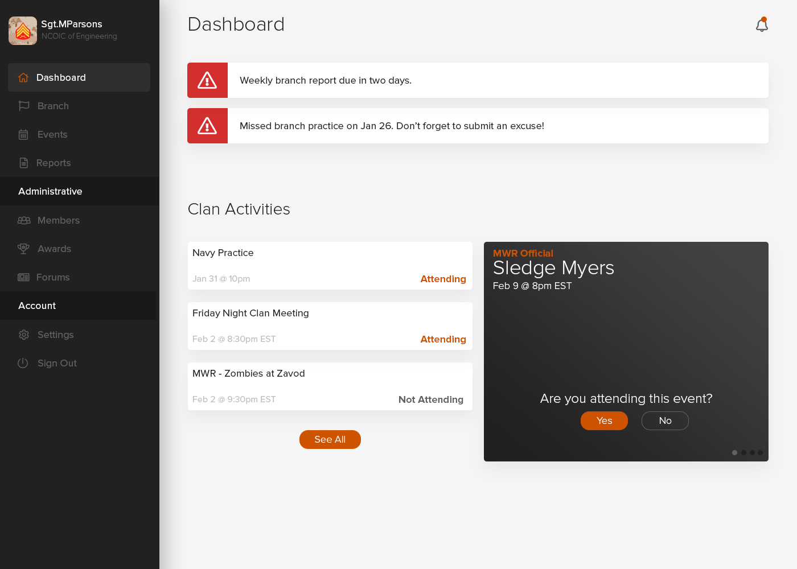
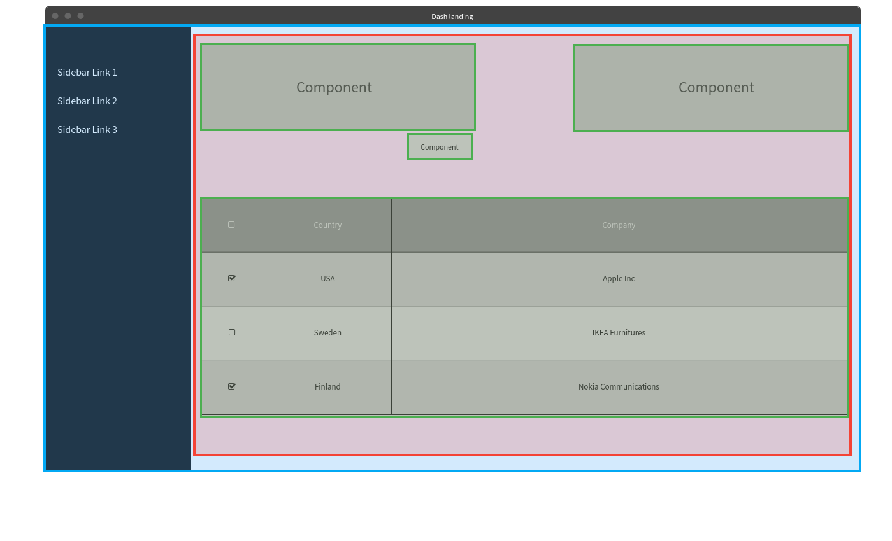

# Modules
Titan is divided into isolated groups of code, known as *modules*, which provide specific domains of features. For example, a `membership` module would contain features related to managing users and user groups. Features outside the domain of managing users, such as managing an event calendar, should reside in a different module.

- [structure](#structure)
    - [actions](#structure-actions)
    - [components](#structure-components)
    - [containers](#structure-containers)
    - [reducers](#structure-reducers)
    - [scenes](#structure-scenes)
    - [services](#structure-services)
    - [test](#structure-test)
- [configuration](#configuration)
    - [routes](#configuration-routes)
- [rendering](#rendering)

## Structure
```
{vendor}-{module}
├─── actions/
├─── components/
├─── containers/
├─── reducers/
├─── scenes/
├─── services/
├─── test/
├─── index.js
```

### actions/
<a id="structure-actions"></a>
Contains a module's redux actions.

An action always updates the redux data store. They can fetch information from [API services](#structure-services), sort data, or perform any other business logic.

### components/
<a id="structure-components"></a>
Contains components that are specific to the module. Generic/universal components, such as form inputs, buttons, tables, cards, etc, should be placed in the `titan-components` module instead.

Components may only contain state and business logic specific to rendering a view. Redux operations do not belong in a component.

### containers/
<a id="structure-containers"></a>
Containers fetch data from the redux store, execute redux actions, and manage callbacks for interactive events (click, change, hover, submit, etc).

A container should render a very minimal template, passing callbacks and redux information as properties into the components it renders.

General purpose containers should be placed in the `titan-core` module.

### reducers/
<a id="structure-reducers"></a>
Contains a module's redux state reducers.

Reducers simply update a piece of the application state. They should not perform API calls, sort data, or execute any other forms of business logic.

### scenes/
<a id="structure-scenes"></a>
Contains a module's top level components.

Scenes are essentially top-level components that build the structure of a page. They construct row/column grids, and place containers or other child components within the grid structure.

They should not contain business logic, API calls, or interact with the redux store.

### services/
<a id="structure-services"></a>
Contains wrappers for API services.

These service classes send requests to external systems. These requests may fetch, create, update, or delete data from another API. They may **not** perform sorting, filtering, or update the redux store. Such logic should exist in a redux action.

### test/
<a id="structure-test"></a>
Instead of having a monolithic test directory in the root of the project, module specific tests are located within the module itself. The directory structure of the `test` directory should mirror the structure of the module. The test files within the directory should mirror the name of the file being tested with `.test.js` appended to the filename.

### Example

```
titan-core
├─── lib/
|    ├─── utils
|         ├─── helperFunctions.js
├─── test/
|    ├─── test/
|         ├─── lib/
|              ├─── utils
|                   ├─── helperFunctions.test.js
├─── index.js
```

### index.js
<a id="structure-index"></a>
Every module will contain an `index.js` file, which defines important information titan must know about the module. See the [configuration section](#configuration) for additional information.

## Configuration
<a id="configuration"></a>
A typical module configuration will look something like this...

```javascript
import CustomLayout from './layouts/CustomLayout'
import HomeScene from './scenes/HomeScene'
export default {
    name: 'titan-core',
    layouts: {
        dashboard: CustomLayout
    },
    routes: {
        'titan-core:index': {
            path: '/',
            exact: true,
            layout: 'dashboard',
            scene: HomeScene
        }
    },
    reducers: []
}
```

### name
Defines the name of the module. Must be unique to all other installed modules. By convention, module names are determined by the vendor and the module's purpose:

    titan-auth

In the example above, the vendor is `titan` and the purpose of the module is to provide `authentication` capabilities. Hence the name `titan-auth`.

### layouts
Titan allows modules to register layouts which can be referenced by any other module. These layouts can be overwritten by child modules to change the default look and feel of the application without changing titan's core modules.

By default, the following layouts are available:

- `dashboard`: Used for administrative or private pages (aka static 12 pages).
- `website`: Used for the front facing website (home page, forums, about, contact, etc.)
- `empty`: Used for scenes that have a very custom structure. For example, a login scene, where the form is vertically centered on the page.

## Routes
<a id="configuration-routes"></a>
Routes define which url paths are accessible from the application. They also determine which layout should be rendered, as well as what content should appear in the content area of the selected layout.

You can define a route as so:

```javascript
// titan-core/index.js
import HomeScene from './scenes/HomeScene'
export default {
    // ...
    routes: [
         {
            path: '/auth/login',
            layout: 'dashboard',
            scene: HomeScene,
            layoutPriority: 0,
            renderPriority: 0
        }
    ]
}
```

| Property         | Type      | Required | Default | Description                                                                                          |
|------------------|-----------|----------|---------|------------------------------------------------------------------------------------------------------|
| `path`           | string    | yes      |         | The url path to the to the page.                                                                     |
| `layout`         | string    | yes      |         | The layout to wrap around the scene.                                                                 |
| `scene`          | Component | yes      |         | The content to render in the layout's content area.                                                  |
| `layoutPriority` | int       | no       | 0       | If this route has the highest layout priority, then its layout will be used when rendering the page. |
| `renderPriority` | int       | no       | 0       | Determines this scene's position in the render order of all other scenes on the page.                |


### Building pages using multiple modules
<a id="rendering"></a>
Url paths are not module specific. In other words, any module can append content to a page. For example, a notifications module might want to add a few alerts to the dashboard page. Additionally, the events module might want to show a list of upcoming activities on the same page.

**events-module/index.js**
```javascript
import UpcomingEventsScene from './scenes/UpcomingEventsScene'
export default {
    // ...
    routes: [
         {
            path: '/dashboard',
            layout: 'dashboard',
            scene: UpcomingEventsScene,
            layoutPriority: 0,
            renderPriority: 0
        }
    ]
}
```

**notifications-module/index.js**
```javascript
import DashboardAlertsScene from './scenes/DashboardAlertsScene'
export default {
    // ...
    routes: [
         {
            path: '/dashboard',
            layout: 'dashboard',
            scene: DashboardAlertsScene,
            layoutPriority: 0,
            renderPriority: 1   // Give the notifications scene a higher renderPriority so it appears before the events list.
        }
    ]
}
```


#### Result
Notice the notification module's scene was rendered before the events module. This is because the notification module set a higher `renderPriority` than the other module.



The following diagram visualizes how the layout, scenes, and components are rendered on the page.




**Blue**: Layout - Constructs the page's header, sidebar, and content area.

**Red**: Scene - Defines the structure of components in the main content area.

**Green**: Component - Simple, reusable piece of the user interface.